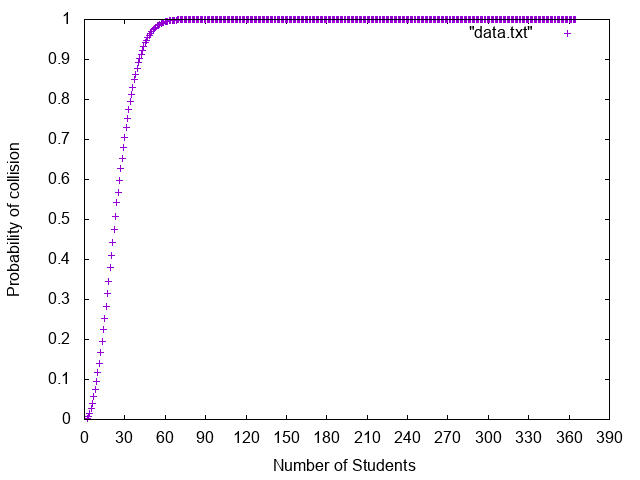

# Birthday Paradox Simulation

## Statement
 Find the number of students in a class such that the probability that at least two students have the same birthday is greater than 'p'.  Your program should input the required probability 'p' and return the number of students (k)

## Mathematical Analysis
   

## Graph made from the results of code
  